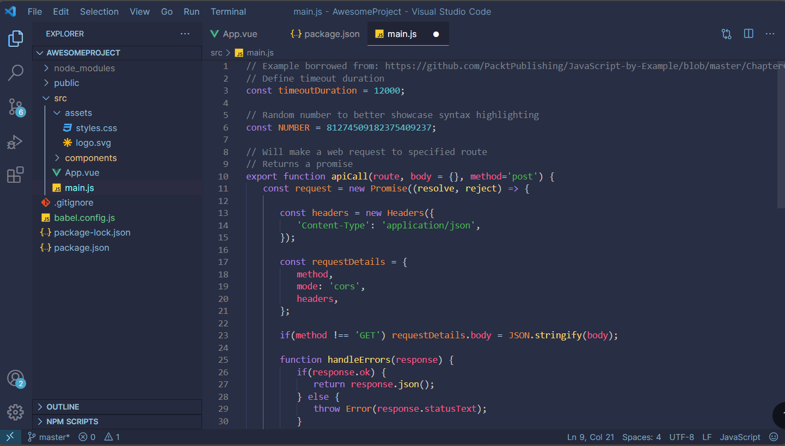

# Tokyo Night City

#### Visual Studio Theme

A vibrant code theme for Visual Studio Code, inspired by the dazzling energy of Tokyo's nightlife. It combines the alluring neons of Tokyo Night with the cool, calming cyan of City Lights, offering a unique and visually stimulating experience for your coding sessions.

## Features

- Navy Blue accent
- Dark base
- Balanced contrast

## Screenshots

### Javascript

### Dart

## Installation

You can install the Tokyo Night City theme directly from the [VS Code Marketplace](https://marketplace.visualstudio.com/items?itemName=EmmanuelCy.tokyo-night-city-vscode-theme). Simply follow the link and click on the "Install" button to add the theme to your Visual Studio Code editor.
[VS Code Marketplace](https://marketplace.visualstudio.com/items?itemName=EmmanuelCy.tokyo-night-city-vscode-theme)

## Recommended Font

It is recommended to use the "Hack Nerd Font" for the best visual experience with the Tokyo Night City theme. You can download and install the font from the [Hack Nerd Font GitHub repository](https://github.com/ryanoasis/nerd-fonts/tree/master/patched-fonts/Hack). Once installed, you can select the "Hack Nerd Font" in your code editor's settings to fully enjoy the theme.

## Color Reference
Here are the main colors used in the Tokyo Night City theme and their hex values:

| Color             | Hex                                                                |
| ----------------- | ------------------------------------------------------------------ |
| Dark Gray |  #0a192f |
| Pink Coral |  #f8f8f8 |
| Cyan |  #00b48a |

## Contributing

Contributions are always welcome!

Please adhere to this project's `code of conduct`.

