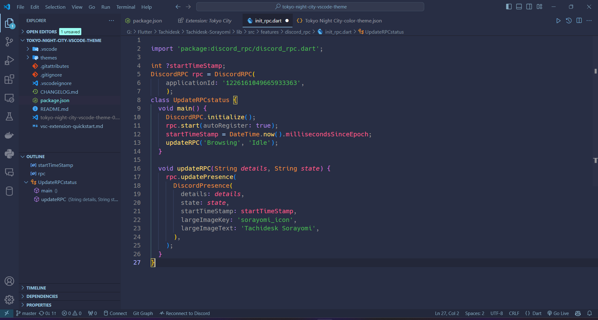

# Tokyo Night City

Visual Studio Theme

Tokyo Night City is a vibrant code theme for Visual Studio Code, inspired by the dazzling energy of Tokyo's nightlife. It combines the alluring neons of Tokyo Night with the cool, calming blues of City Lights, offering a unique and visually stimulating experience for your coding sessions.

## Features

- Navy Blue accent
- Dark base
- Balanced contrast

## Screenshots

## Installation

[VS Code Marketplace](https://marketplace.visualstudio.com/items?itemName=EmmanuelCy.tokyo-night-city-vscode-theme)

    
## Contributing

Contributions are always welcome!

Please adhere to this project's `code of conduct`.

